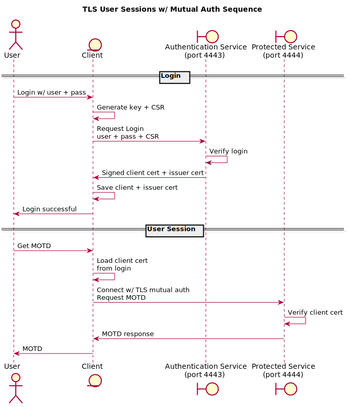

# User Sessions w/ TLS Mutual Auth

This project is a proof-of-concept that demonstrates a method of handling a user
session once a user is authenticated using TLS mutual authentication with x509
certificates; while maintaining a user friendly experience on the client.  This
is an alternative to traditonal session management built on top of the HTTP
that typically involve session tokens inserted into headers or provided via
cookies.

The user is presented with a familiar login workflow by providing a username and
password when initiating a new session.  Behind the scenes, the client sends a
certificate signing request (CSR) along with the username and password, and the
server issues a signed certificate on a successful login.  The client then uses
its issued signed certificate via TLS mutual authentication for the user
session.

A user can start a session on more than one device.  Each time a new device is
used with the server, the user must authenticate with a username and password to
get a signed certificate for their device.

The server generates a self-signed certificate certificate for itself to become
a certificate authority (CA) for authenticated user sessions.  The client must
include this certificate into its trusted chain upon login.

Not demonstrated:

- Endpoints not requiring client cert use certificates from Let's Encrypt
- Out of band user validation (for example, requiring email or SMS verification
    in addition to user+pass)
- Host checking (client should notify the user when server CA changes)
- Server CA lifecycle (renewal)
- Device certificate lifecycle (renewal, revoke, fingerprint verify)
- Secure password check via hash
- Logout
- User management

## Generating Protobuf

Make sure you have `protoc` and `protoc-gen-go` installed.

Follow instructions here: https://developers.google.com/protocol-buffers/docs/gotutorial#compiling-your-protocol-buffers

To generate the Go protobuf code, run:

    protoc -I=pb --go_out=plugins=grpc:pb session.proto

## Making the Demo

You must have [Go](https://golang.org) installed to compile the demo.

A `Makefile` is provided for convenience.  You can see what targets are
available by simply running:

    make

To compile the demo, run the following:

    make build

If you do not have GNU Make, you can run:

    go build -o ./dist/tls-sess-demo ./cmd/tls-sess-demo

## Running the Demo

After compiling the demo, you can run it via:

    ./dist/tls-sess-demo

This will print out the commands available.

To run the demo, you'll need two terminal sessions.  On one, start up the server
by running:

    ./dist/tls-sess-demo serv

In the other terminal, login to the server via:

    ./dist/tls-sess-demo login
    Enter Username: demo
    Enter Password: test123

The username is `demo` and the password is `test123`.  Note that the password
prompt will not display your password as you type.

Enter some phony credentials.

Then run the following to get the server's message-of-the-day:

    ./dist/tls-sess-demo motd

## Testing

This project uses [Ginkgo](https://github.com/onsi/ginkgo) for testing.  To
install, run:

    go get -u github.com/onsi/ginkgo/ginkgo

To run the tests, run:

    make test

## Linting

This project uses [golangci-lint](https://github.com/golangci/golangci-lint) for
linting which performs static code analysis checks.  To install, run:

    GO111MODULE=on go get github.com/golangci/golangci-lint/cmd/golangci-lint@v1.16.0

To run linters, run:

    make lint

## TODO

- Generate a random password to check at the server
- Server generates a self-signed CA cert
- Client generates a key and CSR
- Server signs client CSR on login
- Server endpoint requiring client cert
